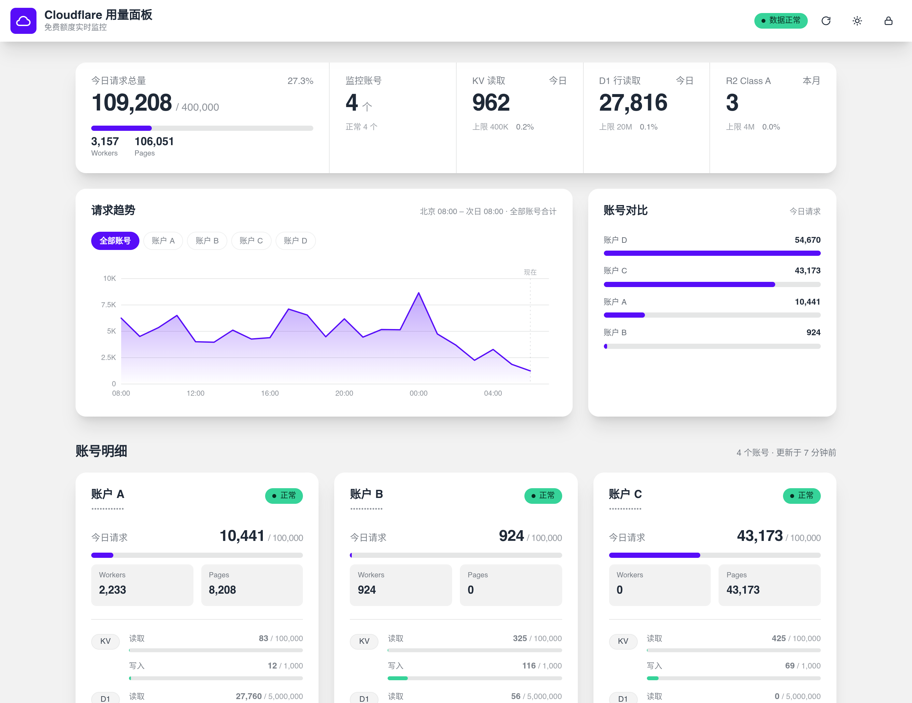
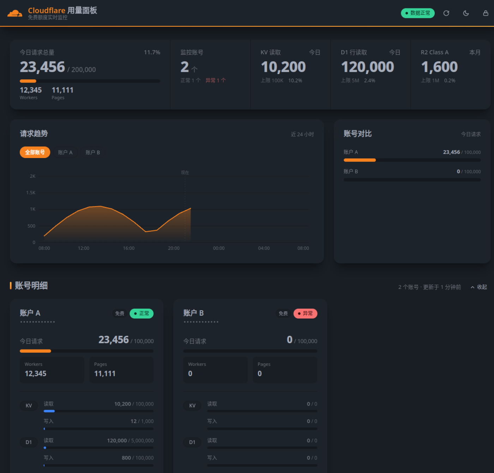
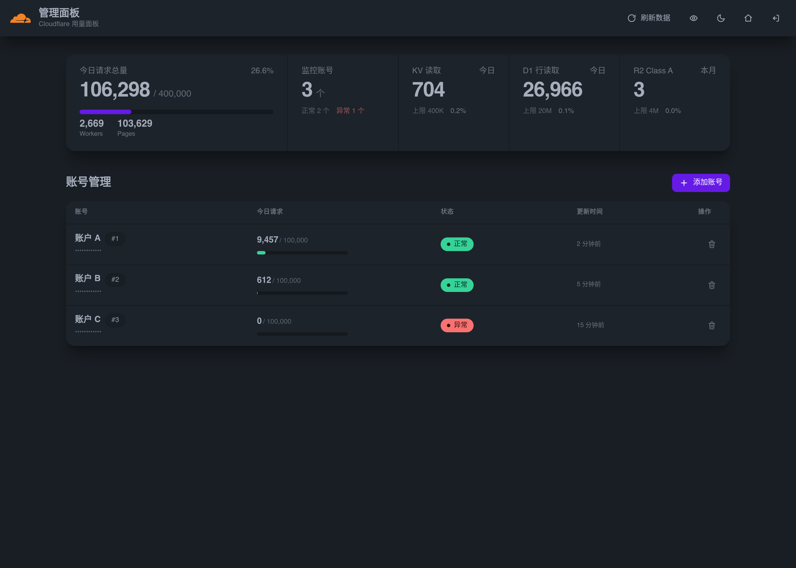
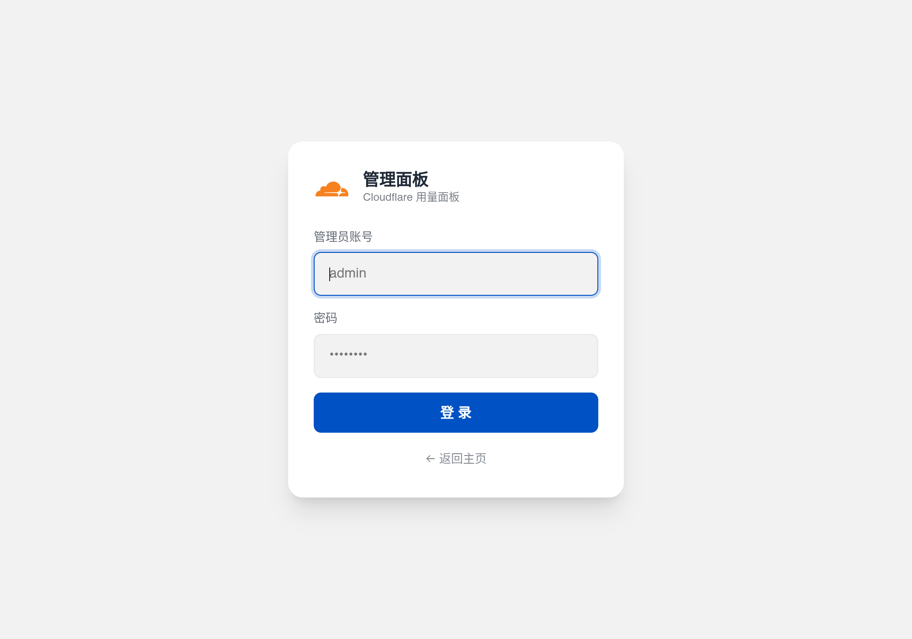

<div align="center">

# CF Usage Panel

**Cloudflare 免费额度监控面板**

多账号 · 请求趋势 · 匿名模式 · daisyUI 风格

<sub>基于 [cmliu/CF-Workers-UsagePanel](https://github.com/cmliu/CF-Workers-UsagePanel) 二次开发，界面与交互完全重写</sub>

</div>

---

## 简介

一个跑在 Cloudflare Workers 上的免费额度监控面板，用来追踪**多个 Cloudflare 账号**的 Workers / Pages 请求量，以及 D1 / KV / R2 的用量。

数据全部来自 Cloudflare 官方的 GraphQL Analytics API，面板自身只需要 **一个 Worker + 一个 KV 命名空间**，可以完全跑在免费额度里。

## 功能

### 多账号用量
- 每个账号一张独立卡片，不再把请求量混成一个总数
- 卡片内含：今日请求（Workers / Pages 拆分）、KV / D1 / R2 的额度进度条
- 点「详情」展开完整明细（KV 删除/列表、各项存储、R2 Class B 等）
- 进度条按用量分级变色：< 60% 绿 · 60–85% 黄 · > 85% 红

### 概览区
- 一张主卡展示**今日请求总量**（Workers + Pages），进度条按额度占比着色
- 主卡可展开四个明细格：Workers / Pages / KV 读取 / D1 行读取
- 右侧两格：监控账号数（含异常计数）、R2 Class A 用量

### 请求趋势
- 近 24 小时的逐小时请求曲线（面积图，纯手写 SVG，零依赖）
- X 轴固定为**北京时间 08:00 → 次日 08:00**，每天 08:00 开启新的统计周期
- 曲线只画到当前小时，右侧留空并标出「现在」位置
- 顶部胶囊可切换「全部账号合计」或任意单账号的趋势
- 鼠标悬停 / 手机滑动可查看任意时间点的精确数值

### 匿名模式
- 访客（未登录）**强制匿名**：账号名显示为「账户 A / B / C」，AccountID 打码
- 登录后可自由切换真名 / 匿名，偏好存在本机
- 支持 `?anon=1` 直接生成匿名链接，方便截图分享

### 管理面板
- 独立登录页，密码保护（Cookie 认证）
- 账号表格：状态、今日请求、更新时间一目了然
- 添加账号时服务端会先校验一次 API Token
- 账号名称随时可改，也能改 Account ID / Token（改了会重新校验）
- 删除账号 / 退出登录都有二次确认

### 其他
- 深色 / 浅色主题（跟随系统，也可手动切换或 `?theme=dark|light` 指定）
- 移动端完整适配，图表支持触摸滑动查看
- 数据每 5 分钟自动刷新，也可点右上角手动强制刷新

## 截图

| 主页（访客视角，已匿名） | 请求趋势 |
|---|---|
|  |  |

| 管理面板 | 登录页 |
|---|---|
|  |  |

## 部署

### 前置条件

- 一个 Cloudflare 账号
- 每个被监控的账号需要：**Account ID** + 一个具备 `Account → Analytics → Read` 权限的 **API Token**
  （在 [API Tokens](https://dash.cloudflare.com/profile/api-tokens) 页面用 “Read analytics” 模板创建）

### 方式一：Wrangler CLI（推荐）

```bash
# 1. 克隆并构建
git clone https://github.com/<你的用户名>/cf-usage-panel.git
cd cf-usage-panel
npm run build

# 2. 创建 KV 命名空间，把输出的 id 填进 wrangler.toml
npx wrangler kv namespace create KV

# 3. 登录并部署
npx wrangler login
npx wrangler secret put PASSWORD     # 设置管理员密码
npx wrangler deploy
```

### 方式二：Dashboard 手动部署

1. 进入 **Workers & Pages** → **创建 Worker**
2. 把构建产物 `dist/worker.js` 的内容粘贴进去并部署
3. 创建一个 **KV 命名空间**，然后在 Worker 的「设置 → 绑定」里添加：
   - 变量名称：`KV`（**必须大写，不能改**）
   - 选择刚创建的命名空间
4. 在「设置 → 变量」里添加：
   - `PASSWORD`（**必填**，类型选「密钥」）
   - `USERNAME`（可选，默认 `admin`）
5. 可选：在「触发器 → Cron」里添加 `0 */6 * * *`，让数据定时刷新

## 配置

| 变量 | 必填 | 默认值 | 说明 |
|---|---|---|---|
| `PASSWORD` | ✅ | — | 管理面板密码，建议用密钥方式设置 |
| `USERNAME` | ⚪ | `admin` | 管理面板账号 |
| `ACCOUNT_CHECK_INTERVAL_MINUTES` | ⚪ | `20` | 单账号最短刷新间隔（分钟），未超过时使用历史数据 |
| `MAX_EXTERNAL_SUBREQUESTS_PER_RUN` | ⚪ | `50` | 每次刷新最多使用的外部子请求数 |

> 每个账号刷新约消耗 5 个外部子请求（趋势查询占 1 个），默认预算下每轮可刷新约 10 个账号。

## 路由

| 路径 | 说明 |
|---|---|
| `/` | 主页，展示所有账号的用量与趋势 |
| `/admin` | 管理面板（未登录时显示登录页） |
| `/api/login` | 登录 |
| `/api/logout` | 退出登录 |
| `/api/me` | 查询当前登录状态 |
| `/api/add` · `/api/edit` · `/api/del` | 添加 / 修改 / 删除账号 |
| `/accounts.json` | 账号级数据接口（含趋势），需要 token 参数 |
| `/usage.json` | 汇总数据接口（兼容上游），需要 token 参数 |

## 本地开发

```bash
npm run build   # 把 src/*.html 注入 src/worker.js，输出 dist/worker.js
npm test        # 构建 + 跑四个测试（后端接口 / 主页渲染 / 管理面板渲染 / 账号编辑）
npm run dev     # 本地起 wrangler dev（需要先配好 wrangler.toml）
```

项目结构：

```
src/
  worker.js     # 后端逻辑 + 路由（页面函数是占位，由 build 注入）
  home.html     # 主页
  admin.html    # 管理面板
  login.html    # 登录页
build.js        # 构建脚本
test/           # 四个测试（用 DOM stub 在 Node 里跑渲染，不需要浏览器）
dist/worker.js  # 构建产物（.gitignore，部署用）
```

> 三个 HTML 都刻意**不使用反引号和 `${}`**，这样 build 注入到模板字符串时只需要极少的转义，避免踩坑。

## 与上游的差异

- 主页从「所有账号汇总成一张卡」改为**每账号一张独立卡片**
- 新增请求趋势图（按北京时区业务日）与账号对比图
- 新增匿名模式与登录态感知的顶栏按钮
- 管理面板、登录页完整重做，与主页统一为 daisyUI 风格
- 新增 `/accounts.json`、`/api/me` 接口
- 新增账号编辑（改名、改 API 信息）
- 移除上游页脚署名、移除管理面板的「复制 API 地址」按钮

## 常见问题

**Q：部署后打开提示「请先绑定一个 KV 命名空间到变量 KV」**
KV 绑定的变量名必须是 `KV`（全大写），且需要重新部署一次。

**Q：某个账号显示「异常」**
多半是 API Token 权限不足或 Account ID 填错。Token 需要有 `Account → Analytics → Read` 权限。

**Q：趋势图某个账号的曲线比别的短**
说明该账号在这段时间里有若干小时完全没有请求，那些小时不会有数据点。

**Q：为什么「今日请求」和趋势图的时间范围一样？**
Cloudflare 的免费额度按 UTC 自然日重置，而 UTC 00:00 正好等于北京时间 08:00，所以两者是同一个区间。

## 致谢

- 上游项目：[cmliu/CF-Workers-UsagePanel](https://github.com/cmliu/CF-Workers-UsagePanel)
- UI 设计参考 [daisyUI](https://daisyui.com/) 的语义色板与组件规范

## License

[GPL-3.0](LICENSE) —— 因衍生自 GPLv3 项目，本项目同样以 GPLv3 开源。
